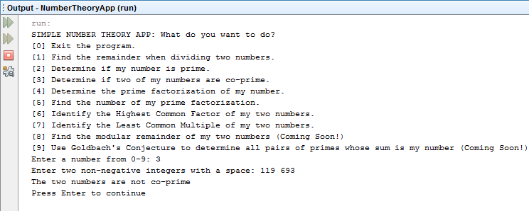

# BasicNumberTheoryApp
A simple application, runnable through command prompt, that demos basic number theory concepts. 

## Pre-requisites and Requirements
- Java 7 or 8
- Command Prompt OR any IDE (eg. NetBeans is an example used here)

## Screenshots

More screenshots in the `screenshots` folder

## Running the App
1. Navigate through this folder: `NumberTheoryApp > src > numbertheoryapp`. Download the Java file.
2. To run `NumberTheoryApp.java`, compile first using the Command Prompt. Navigate the directory of the location of the java file using the cmd and then type `javac NumberTheoryApp.java`. (Can be run in an IDE with a built-in compiler, NetBeans in this example)
3. Now in your cmd, type `java NumberTheoryApp` to run.

## Features
- Remainder when one number is divided by the other (using integer modulo)
- Prime and Co-Prime Tests
- Prime Factorization
- Highest Common Factor and Least Common Multiple
- Modular Exponentiation (Coming Soon!)
- Goldbach's Conjecture (Coming Soon!)

## License
MIT License  
A short and simple permissive license with conditions only requiring preservation of copyright and license notices. Licensed works, modifications, and larger works may be distributed under different terms and without source code.
